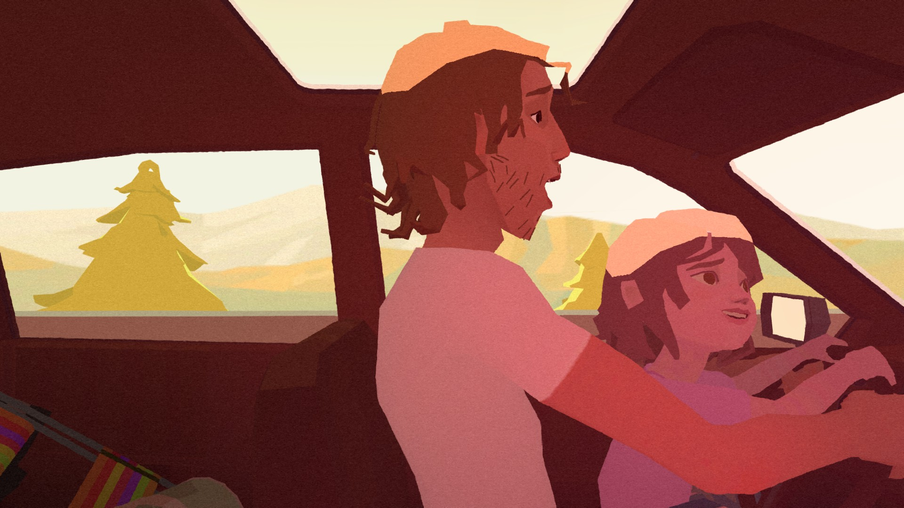

# Pearl, preserved ("Project Oyster")


<sub>*Sara takes the wheel on her dad's lap - rendered by this project's engine from the original
data. Pearl (c) Google.*</sub>

*Pearl* (2016) follows a girl and her father across the country in the old hatchback that is
their home on the road - years of their lives, told entirely from inside the car, carried by a
song they share. Directed by Patrick Osborne for Google Spotlight Stories, it was nominated for
the **Academy Award for Best Animated Short Film**, the first VR film ever to be nominated for an
Oscar.

It was made to be watched from the passenger seat. Its VR version, though, only runs on a
Windows PC with SteamVR - not on the standalone headsets most people use today - and its Steam
page is not visible in every country. Project Oyster keeps that seat open: Pearl's own story, animation, shaders and music,
running natively on a modern standalone headset (Meta Quest 3, OpenXR). Preserved, not remade.

* **The original film, unchanged:** Pearl's own Lua story scripts run in our engine (LuaJIT),
  with the original models, animation, shaders, post-effect render graphs, particles, lights
  and sound - the whole film, story transitions frame-exact against captures of the original.
* **Faithful VR:** the original's stereo path (eye offsets, IPD scaling, per-eye render graph,
  seated-viewer logic) reproduced from the engine.
* **Native on Meta Quest 3:** OpenXR app at 72 Hz, eye images 2184x2288, 2x MSAA in tile memory,
  textures used as they are (DXT5), shaders compiled once and cached.
* **Smooth:** multithreaded rendering (story/animation and GL driver work on separate cores),
  resources prefetched and uploaded before shot changes - no hitches.
* **Options:** interpolated animation (default: original stepped keys), resolution scale, and an
  eye height offset (default +30 cm, which puts the viewer at eye level with Dad; 0 = original).
* **Bring your own copy:** the installer finds your Steam installation, verifies it against
  SHA-256 manifests and copies it to the headset; no Pearl data is distributed.

This repository contains **only our own code, tools, manifests (hashes) and documentation** — no
Pearl assets or binaries. Bring your own legally obtained installation (Steam AppID 476540; the
store page is region-restricted - not shown in some countries, e.g. Germany, but e.g. in the
US).

## Play it on Meta Quest 3

Download the latest [release](https://github.com/SputnikKaputtnik/pearl-oyster/releases), unpack
it, connect the Quest by USB (developer mode) and double-click `Install Pearl on Quest.cmd`. The
installer finds your Steam copy, verifies it, copies it to the headset and installs the app.

Controls while the film plays (Touch controllers):

| Control | Effect |
|---|---|
| **A** (right) / **X** (left) | animation: original (stepped keys, as authored) or interpolated |
| thumbstick up / down | eye height in 5 cm steps (default +30 cm; not in the original, 0 = original) |

Settings (resolution, MSAA, defaults of the above) are in `/sdcard/Oyster/oyster.cfg` on the
headset. Details: [runtime/apps/quest/README.md](runtime/apps/quest/README.md).

## Status

* Phase 1 (forensics) — complete for the Steam build 1340090.
* Phase 2 (own runtime) — the original Lua story plays the whole film in our engine
  ([docs/player.md](docs/player.md)): desktop player (frame-exact against captures of the
  original) and a native Quest 3 app (OpenXR, [docs/vr.md](docs/vr.md)), 72 Hz.

License: MIT ([LICENSE](LICENSE)); third-party components: [THIRD_PARTY.md](THIRD_PARTY.md).

| Document | Contents |
|---|---|
| [docs/preservation.md](docs/preservation.md) | reference installation, preservation copy, verification, user-state files |
| [docs/architecture.md](docs/architecture.md) | runtime vs content layers, native engine services, how Lua drives the story, camera path |
| [docs/launch-chain.md](docs/launch-chain.md) | Steam → exe → engine → Lua → scene loading |
| [docs/runtime-observations.md](docs/runtime-observations.md) | observed runs: modules, file access, writes, RenderDoc result |
| [docs/runtime-analysis.md](docs/runtime-analysis.md) | PE analysis: graphics, VR, audio, Lua, CLI switches |
| [docs/cli-reference.md](docs/cli-reference.md) | command-line options decoded with Ghidra, capture/record formats |
| [docs/engine-internals.md](docs/engine-internals.md) | time model, capture pipeline, VR frame loop (Ghidra) |
| [docs/file-formats.md](docs/file-formats.md) | `.mxm`, `.mxa`, `.mxb`, `.shd`, `.pfb`, DDS, OGG, HRTF — first characterization |
| [docs/reference-capture.md](docs/reference-capture.md) | how to record ground truth from the original |
| [docs/quest-port-plan.md](docs/quest-port-plan.md) | route assessment and Phase 2 plan |

## Layout

```
docs/        findings (facts / inferences / unknowns marked)
manifests/   SHA-256 manifests of the reference installation (+ classified inventory)
tools/       small, read-only analysis tools (Python 3.11; pefile, lupa)
research/    curated analysis outputs (symbol tables, probes, checks)
```

Bulk derived data (string dumps, JSON dumps of the Lua data) is regenerated into
`C:\Tools\pearl-work\` and never committed.

## Tools

| Tool | Purpose |
|---|---|
| `tools/manifest.py create/verify/diff` | path/size/SHA-256 manifest of an installation |
| `tools/classify.py` | layer/kind classification of a manifest |
| `tools/pe_inspect.py` | PE headers, imports, exports, version info |
| `tools/demangle_exports.py` | demangled C++ export table (Windows dbghelp) |
| `tools/source_paths.py` | build source paths embedded in binaries |
| `tools/format_probe.py` | header survey per extension (Moxie container ids, DDS FourCC, Ogg) |
| `tools/lua_data_dump.py` | evaluate the story's Lua data files in a sandbox → JSON |
| `tools/lua_requires.py` | Lua `require` dependency tree / Mermaid graph |
| `tools/reference_check.py` | do all `package:path` references resolve? |
| `tools/package_manifest_check.py` | Spotlight build manifests vs files on disk |
| `tools/observe_run.py` | launch + observe a run from outside (modules, open files, clean WM_CLOSE) |
| `tools/procmon_filter.py` | reduce a Procmon CSV to one process, per-file access summary |
| `tools/rdoc_capture.py` | RenderDoc inject + triggered captures (qrenderdoc --python); not usable for Moxie |
| `tools/apitrace_run.py` | apitrace GL capture with timed WM_CLOSE |
| `tools/thread_sampler.py` | sample thread instruction pointers of a running process → module+offset per thread |
| `tools/ghidra/*.java` | headless Ghidra scripts: string users, decompile by name |

Requirements: `pip install pefile lupa`.

## Ground rules

Preservation, not remake: no changes to animation timing, cadence, choreography, lighting,
materials, shaders (except technically equivalent ports), audio, story logic or triggers.
Allowed improvements: render resolution, anti-aliasing, texture filtering, display output.
No AI upscaling or asset replacement.

## AI disclosure

This project was developed with substantial help from an AI coding assistant (Claude by
Anthropic, via Claude Code): reverse engineering, runtime and installer code, tests and
documentation. Results were checked against the original (frame comparisons with captures,
byte-identical regression images, bit-identical audio across decoder changes) and releases are
tested in the headset by a human.
